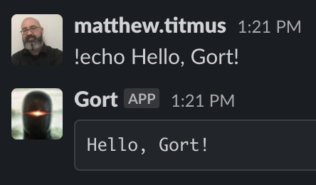

# Quick Start

This page will tell you how to quickly create a Slack Bot User and get Gort up and running in a container in development mode.

## Create your Configuration File

1. Copy `config.yml` to `development.yml`.

## Create a Slack Bot User

1. If you haven't done so already, [create a new Slack workspace](https://slack.com/help/articles/206845317-Create-a-Slack-workspace).

1. Use this link to create a new Slack (Classic) app: [https://api.slack.com/apps?new_classic_app=1](https://api.slack.com/apps?new_classic_app=1). Choose your application name and select the workspace you just created, and click "Create App".

1. Under "Add features and functionality", click "Bots". This will bring you to "App Home".

1. Click the "Add Legacy Bot User" button. Enter the display name and username, and click "Add".

1. On the left-hand bar, under "Settings", click "Basic Information", then click the "Install to Workspace" button.

1. You'll get a screen that says something like "Gort is requesting permission to access the $NAME Slack workspace"; click "Allow"

1. On left-hand bar, under "Features", click "OAuth & Permissions".

1. At the top of the screen, you should see "OAuth Tokens for Your Workspace" containing a "Bot User OAuth Token" that starts with `xoxb-`. Copy that value, and paste it into the `slack` section of your `development.yml` config file as `api_token`.

## Build the Gort Image

_This step requires that Docker be installed on your machine._

To build your own Gort Docker image, type the following from the root of the Gort repository:

```bash
make image
```

You can verify that this was successful by using the `docker images` command,

```bash
$ docker images
REPOSITORY       TAG            IMAGE ID        CREATED             SIZE
getgort/gort     0.6.0-dev.3    dea1c24f73f3    43 seconds ago      107MB
getgort/gort     latest         dea1c24f73f3    43 seconds ago      107MB
```

This should indicate the presence of two images (actually, one image tagged twice) named `getgort/gort`.

## Starting Containerized Gort

Finally, from the root of the Gort repository, you can start Gort by using `docker compose` as follows:

```bash
docker compose up
```

If everything works as intended, you will now be running three containers: 

1. Gort
2. Postgres (a database, to store user and bundle data)
3. Jaeger (for storing trace telemetry)

## Bootstrapping Gort

Before you can use Gort, you have to bootstrap it by creating the `admin` user.

You can do this using the `gort bootstrap` command and passing it the email address that your Slack provider knows you by, and the URL of the Gort controller API (by default this will be `localhost:4000`):

```bash
$ gort bootstrap --email your.name@email.com localhost:4000
User "admin" created and credentials appended to gort config.
```

## Using Gort

You should now be able to use Gort in any Slack channel that includes your Gort bot. Any Gort commands should be prepended by a `!`. For example, try typing the following in Slack:

`!echo Hello, Gort!`

If everything works as expected, you should see an output something like the following:



This instructs Gort to execute the `echo` command, which is part of the `echo` bundle. Alternatively, you could have specified the bundle as well by typing something like:

`!echo:echo Hello, again, Gort!`

